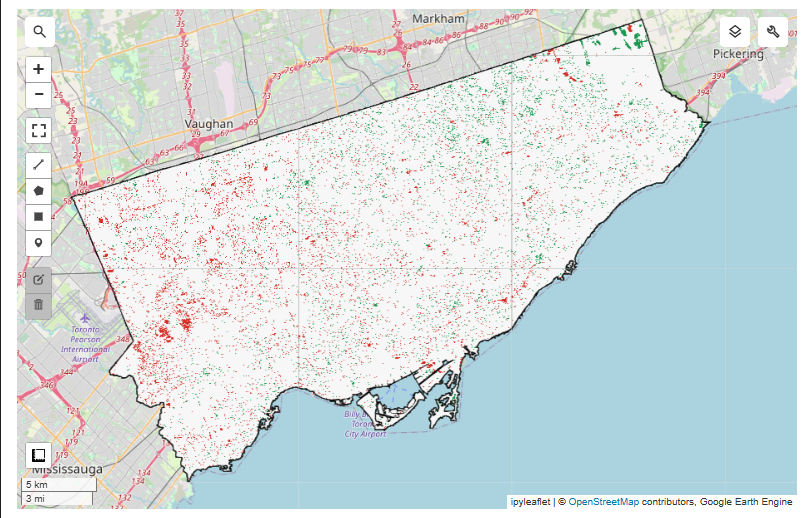

# 🌲 Urban Tree Canopy Change Detection — Toronto (2019 vs 2023)

Detecting urban tree canopy loss and gain across Toronto using Sentinel-2 satellite imagery and Google Earth Engine.

## What this project shows

The map below shows every pixel in Toronto where tree canopy **changed** between 2019 and 2023:

- 🔴 **Red** = trees that existed in 2019 but are gone by 2023 (loss)
- 🟢 **Green** = new tree cover that appeared by 2023 (gain)
- ⬜ **White** = no change



### Key findings
- **Heavy tree loss in the west** (Etobicoke/airport corridor) — likely linked to construction and development
- **More canopy gain in the northeast** (Scarborough) — lower-density residential areas and ravine systems
- **Scattered loss across downtown** — ongoing infill development removing trees
- This analysis replicates the kind of monitoring Toronto's Urban Forestry division uses to track their 40% canopy cover target

## How it works

1. Loads Sentinel-2 satellite imagery for Toronto summers of 2019 and 2023
2. Filters out cloudy images and creates clean median composites
3. Calculates NDVI (vegetation index) — pixels above 0.4 are classified as tree canopy
4. Subtracts the 2019 canopy map from 2023 to detect change
5. Calculates total canopy area in km² for each year

## Stack
Python · Google Earth Engine · geemap · geopandas · rasterio · folium

## Data Sources
| Dataset | Source |
|---|---|
| Sentinel-2 SR Harmonized | Copernicus via Google Earth Engine |
| City Boundaries | FAO GAUL via Google Earth Engine |
| Census Income Data | Statistics Canada 2021 (stretch goal) |

---

## Running this project yourself

### Prerequisites
You will need:
- A free [Google Earth Engine account](https://earthengine.google.com/signup/) — use a university email for instant approval
- [Miniconda](https://docs.anaconda.com/miniconda/) for Python environment management
- [VS Code](https://code.visualstudio.com/) with the Python and Jupyter extensions

### 1. Clone the repo
```bash
git clone https://github.com/sprihaathumma/urban-tree-canopy-canada-.git
cd urban-tree-canopy-canada-
```

### 2. Create the Python environment
```bash
conda create -n geoenv python=3.11 -y
conda activate geoenv
conda install -c conda-forge geopandas rasterio rasterstats folium mapclassify -y
pip install earthengine-api geemap numpy pandas matplotlib seaborn scikit-learn jupyter
```

### 3. Authenticate Google Earth Engine
```bash
earthengine authenticate
```
Follow the browser prompts and log in with the Google account linked to your GEE account.

### 4. Open the notebook in VS Code
Open VS Code → File → Open Folder → select this project folder → open `notebooks/01_data_acquisition.ipynb` → select the `geoenv` kernel → Run All.

> **Note:** When running `ee.Initialize()` add your GEE project ID:
> ```python
> ee.Initialize(project='your-project-id-here')
> ```
> You can find your project ID at [code.earthengine.google.com](https://code.earthengine.google.com)

---
